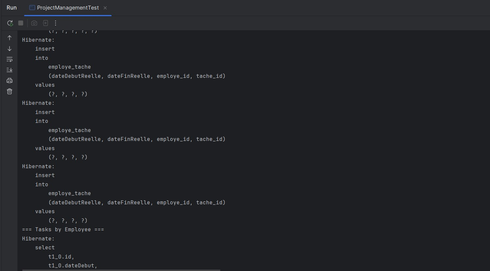
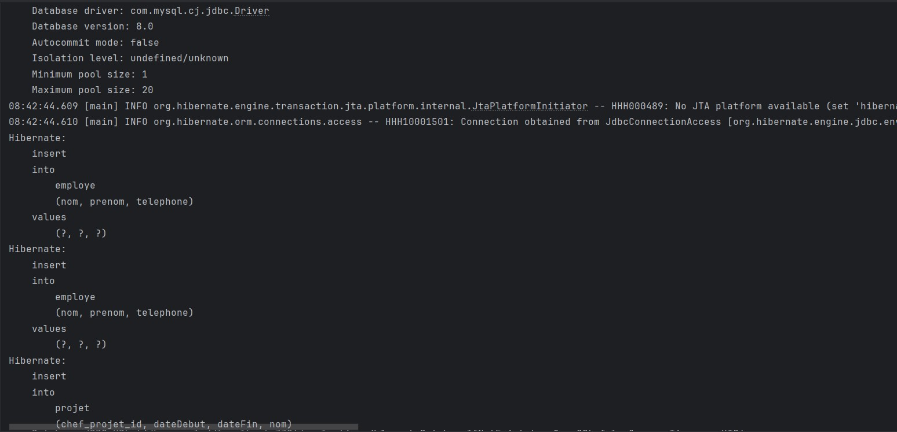
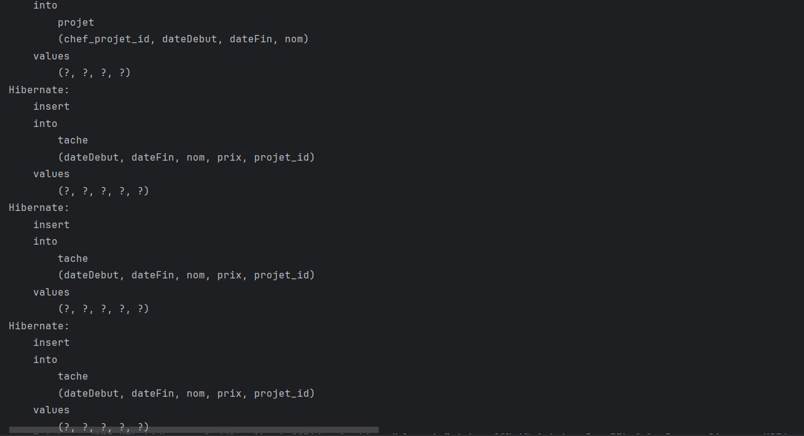
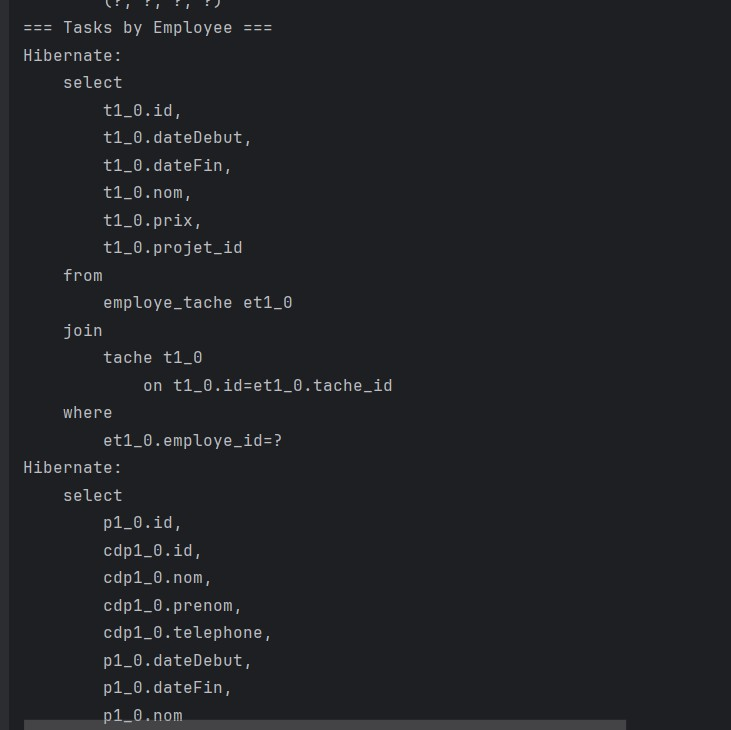

# Projet JPA / Hibernate – Gestion de Commandes, Projets et Mariages






## 1. Structure du projet

ma.projet
│
├─ beans / classes       # Entités JPA (Produit, Commande, Tache, Employe, Homme, Femme, Mariage…)
├─ dao                  # Interface générique IDao
├─ service              # Implémentations des services (ProduitService, TacheService…)
├─ util                 # HibernateUtil pour la configuration Hibernate
├─ test                 # Programmes de test pour chaque service
└─ resources
   └─ application.properties  # Configuration de la base de données


---

## 2. Couche Persistance

1.Entités JPA
   - Annoter les classes avec `@Entity`, `@Table` et `@Id`.
   - Exemples :
     - `Produit` : référence, prix, quantité.
     - `Commande` : numéro, date, liste de produits (`@OneToMany`).
     - `Tache`, `Projet`, `Employe`, `EmployeTache`, `Homme`, `Femme`, `Mariage`.

2. Configuration
   - Fichier `application.properties` :
     ```properties
     spring.datasource.url=jdbc:mysql://localhost:3306/nom_base
     spring.datasource.username=root
     spring.datasource.password=
     spring.datasource.driver-class-name=com.mysql.cj.jdbc.Driver

     spring.jpa.hibernate.ddl-auto=update
     spring.jpa.show-sql=true
     spring.jpa.properties.hibernate.format_sql=true
     spring.jpa.properties.hibernate.dialect=org.hibernate.dialect.MySQLDialect

     spring.application.name=Evaluation
     ```

3. Classe HibernateUtil
   - Fournit la `SessionFactory`.
   - Permet d’ouvrir des sessions Hibernate pour persister ou récupérer les données.

---

## 3. Couche Service

1. Interface IDao
   ```java
   public interface IDao<T> {
       T save(T t);
       T update(T t);
       void delete(T t);
       T findById(int id);
       List<T> findAll();
   }
Services

ProduitService

Afficher les produits par catégorie.

Afficher les produits commandés entre deux dates.

Afficher les produits d’une commande donnée.

Afficher les produits dont le prix > 100 DH (requête nommée).

CommandeService

Affichage formaté des commandes et produits :

yaml
Copier le code
Commande : 4     Date : 14 Mars 2013
Liste des produits :
Référence   Prix    Quantité
ES12        120 DH  7
ZR85        100 DH  14
EE85        200 DH  5
ProjetService, TacheService, EmployeService, EmployeTacheService

Afficher les tâches planifiées et réalisées.

Afficher les projets gérés par un employé.

Afficher les tâches réalisées par un employé.

Afficher les tâches entre deux dates ou dont le prix > 1000 DH (requête nommée).

HommeService, FemmeService, MariageService

Afficher les épouses d’un homme entre deux dates.

Afficher le nombre d’enfants d’une femme entre deux dates.

Afficher les femmes mariées deux fois ou plus.

Afficher les mariages d’un homme avec tous les détails.

4. Programmes de test
Créer des objets exemples dans main() ou classes de test JUnit.

Exemples de tests :

Ajouter 10 femmes et 5 hommes.

Afficher toutes les femmes.

Afficher la femme la plus âgée.

Afficher les épouses d’un homme.

Afficher les mariages d’un homme avec détails.

Afficher les produits d’une commande donnée.

Afficher les tâches réalisées par un employé.

5. Exemple d’exécution
Commande affichée :

yaml
Copier le code
Commande : 4     Date : 14 Mars 2013
Liste des produits :
Référence   Prix    Quantité
ES12        120 DH  7
ZR85        100 DH  14
EE85        200 DH  5
Projet affiché :

swift
Copier le code
Projet : 4      Nom : Gestion de stock     Date début : 14 Janvier 2013
Liste des tâches:
Num Nom            Date Début Réelle   Date Fin Réelle
12  Analyse        10/02/2013          20/02/2013
13  Conception     10/03/2013          15/03/2013
14  Développement  10/04/2013          25/04/2013
Mariages affichés :

yaml
Copier le code
Nom : SAFI SAID
Mariages En Cours :
1. Femme : SALIMA RAMI   Date Début : 03/09/1990    Nbr Enfants : 4
2. Femme : AMAL ALI      Date Début : 03/09/1995    Nbr Enfants : 2
3. Femme : WAFA ALAOUI   Date Début : 04/11/2000    Nbr Enfants : 3

Mariages échoués :
1. Femme : KARIMA ALAMI  Date Début : 03/09/1989    
Date Fin : 03/09/1990    Nbr Enfants : 0
6. Étapes d’exécution
Configurer MySQL et créer la base de données.

Modifier application.properties avec le nom d’utilisateur, mot de passe et nom de la base.

Lancer le projet via votre IDE (Eclipse/IntelliJ) ou Maven :

bash
Copier le code
mvn spring-boot:run
Vérifier que la base de données est générée automatiquement (ddl-auto=update).

Exécuter les programmes de test pour valider les fonctionnalités.
# Contributors

- **AsmaElmourabite**

yaml
Copier le code

---

